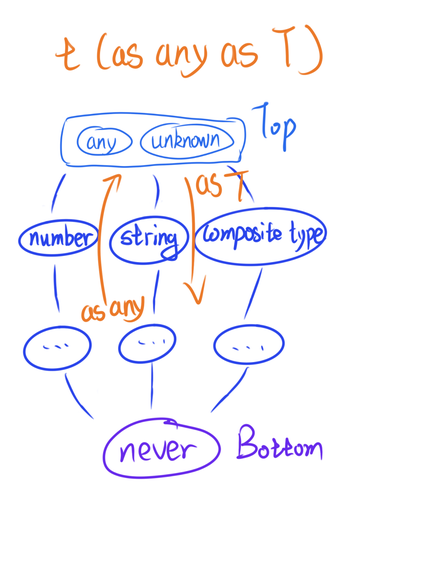

# 介于 TypeScript 与 JavaScript 之间

在这里我将 `as`, `is`, `satisfies` 和 `in` 也归类于此节，实际上来说它们也算是确保一个什么类型的行为，只是位于 TypeScript 与 JavaScript 的边界中，将变量的类型显式的与目标的类型按照规则进行匹配。

## 赞美 `as`

对于 `as` 这种常见的操作符来说，一般会在几个位置中出现。
* 作为 JavaScript 与 TypeScript 的交界处，将某一个 JavaScript 中的值作为一个类型去与 TypeScript 中的类型进行断言
* 作为 TypeScript 中的类型断言，将某一个 TypeScript 中的类型作为一个类型去与 TypeScript 中的类型进行断言

在这里我采用了[《TypeScript Deep Dive》](https://basarat.gitbook.io/typescript/type-system/type-assertion#type-assertion-vs.-casting)中的说法，倾向于 `as` 是作为一个「Assertion（断言）」，而不是一个「Casting（转化）」。

```typescript
interface A {
    a: string
}
// 作为 JavaScript 与 TypeScript 的交界处
const a0 = { a: '1' } as A
const a1 = { b: 1 } as A // TS2352: Conversion of type '{ b: number; }' to type 'A' may be a mistake
                         // because neither type sufficiently overlaps with the other.
                         // If this was intentional, convert the expression to 'unknown' first.
                         // Property 'a' is missing in type '{ b: number; }' but required in type 'A'.
// 在上面我们断言了 `{ b: 1 }` 是一个 A 类型，但是实际上他完全和 A 没有关系
// 于是乎 TypeScript 便也给我们抛出来了一个错误
const a2 = {  } as A
const a3 = { a: '1', b: 1 } as A

type A0 = { a: string } extends A ? true : false
//   ^? type A0 = true
type A1 = { b: number } extends A ? true : false
//   ^? type A1 = false
// 在上面的 `{}` 实际上被**隐式推断**为了 `any`，所以这里使用 `any` 进行测试
// 这里我们暂且记住**隐式推断**，在下文中我会去解释他
type A2 = [any] extends [A] ? true : false
//   ^? type A2 = true
type A3 = { a: string, b: number } extends A ? true : false
//   ^? type A3 = true
```

上面是我们对 `as` 的一个简单的了解，他的行为很类似于使用 `extends` 对俩个类型进行推断。但是我们也从中发现了一些令人感到十分疑惑不解的部分，为什么我们使用 `{}` 会被**隐式推断**为 `any` 呢？他会不会在其他的地方被触发呢？
在我们对 `as` 进行深入探索之前我们需要回忆一下在 TypeScript Handbook 中对 `as` 行为的这句定义「[转化向一个更具体（more specific）或者更不具体（less specific）版本的类型](https://www.typescriptlang.org/docs/handbook/2/everyday-types.html#:~:text=convert%20to%20a%20more%20specific%20or%20less%20specific%20version%20of%20a%20type)」。
```typescript
type A = 1

// 在这里当我们尝试将 1 断言为 A 时，表面上看一切都是没问题的
const a0 = 1 as A
// 但是实际上我们在触发断言操作的前方出现了一个 literal primitive type
// 实际上他会触发一个隐式推断，所以实际的执行效果是 `2 as number as A`
const a1 = 2 as A
const a2 = Number() as A
```

对于上面的几个来说类型的运算看起来都能通过 `V as number as A` 进行解释，但是在下面可以发现了一个问题，哪怕我们强制 `as` 了一个 `const` 的类型，又或者是依赖 TypeScript 自己的 literal type 转化出来的 const 类型也能通过类型校验。
```typescript
const t0 = 2
const t1 = t0 as A
const t2 = 2 as const as A
const t3 = 2 as 2 as 1
```
`2 as 1` 这是一个被 TypeScript 被允许的行为，但是只被允许在 primitive type 中，当俩个 literal primitive type 的 `supertype` 一致时，则会被允许被断言所操作。
```typescript
const x0 = 1 as true // TS2352: Conversion of type 'number' to type 'true' may be a mistake because neither type sufficiently overlaps with the other.
                     // If this was intentional, convert the expression to 'unknown' first.
const x1 = true as boolean
// less specific
const x2 = Boolean() as true
// more specific

type B = { b: 1 }

const b0 = { b: 1 } as B
const b1 = { b: 2 } as B // TS2352: Conversion of type '{ b: 2; }' to type 'B' may be a mistake because neither type sufficiently overlaps with the other.
                         // If this was intentional, convert the expression to 'unknown' first.
                         //   Types of property 'b' are incompatible.
                         //     Type '2' is not comparable to type '1'.
const b2 = { b: 2 as number } as B
const b3 = { b: 2 }
const b4 = b3 as B
const b5 = { b: 2 } as const
const b6 = b5 as B // TS2352: Conversion of type '{ readonly b: 2; }' to type 'B' may be a mistake because neither type sufficiently overlaps with the other.
                   // If this was intentional, convert the expression to 'unknown' first.
                   //   Types of property 'b' are incompatible.
                   //     Type '2' is not comparable to type '1'.
type C = [1]

const c0 = [1] as C
const c1 = [2] as C // TS2352: Conversion of type '[2]' to type 'C' may be a mistake because neither type sufficiently overlaps with the other.
                    // If this was intentional, convert the expression to 'unknown' first.
                    //   Type '2' is not comparable to type '1'.
const c2 = [2 as number] as C
const c3 = [2]
const c4 = c3 as C
const c5 = [2] as const
const c6 = c5 as C // TS2352: Conversion of type 'readonly [2]' to type 'C' may be a mistake because neither type sufficiently overlaps with the other.
                   // If this was intentional, convert the expression to 'unknown' first.
                   //   The type 'readonly [2]' is 'readonly' and cannot be assigned to the mutable type 'C'.
```
在上面关于 B 和 C 类型的测试中，我们可以看到一旦 literal primitive type 进入到 `{}`、`[]` 中便会丢失该特性，那么我们再来尝试将其拆出来进行验证。

```typescript
const b00 = 2 as B['b']
const c00 = 2 as C[number]
const c01 = 2 as C[0]
```

好了，基于上述我们对 `as` 的各种行为观察，我们可以得到一些结果。
* 当 `as` 操作的左侧类型出现了 literal primitive type 时 TypeScript 会将其隐式推断为其的 `supertype`，如：`1` -> `number`、`true` -> `boolean`，在这个基础上进行是否为 supertype 或 subtype 的判断。
* 当 `as` 操作的左侧为非 primitive 的 literal value 时，将其隐式推断为对应的 const 类型，再进行是否为 supertype 或 subtype。
* 当 `as` 操作的左侧为 `{}` 类型时，隐式转化为 any 进行是否为 supertype 或 subtype 的判断。

我们再以一图解释一下 `as any as T` 是如何工作的：



在 top type 与 bottom type 之间的任意类型，都可以通过 more specific 和 less specific 来到 top 或者 bottom 中，再从其前往任意一个类型，从而解决了不同类型之间的隔断。

所以其实除了 `as any as T` 还有 `as unknown`、`as never` 均可用于解决该问题。

> 拓展阅读：
> * [Type hierarchy tree](https://www.zhenghao.io/posts/type-hierarchy-tree)
> * [Unknown vs any](https://stackoverflow.com/a/67314534/15375383)
>
> 相比较使用 `any` 作为中间类型，使用 `unknown` 会更好，因为前者是编译器开的洞，至于为什么不是 `never` 呢，主要还是语义看起来有点奇怪。
